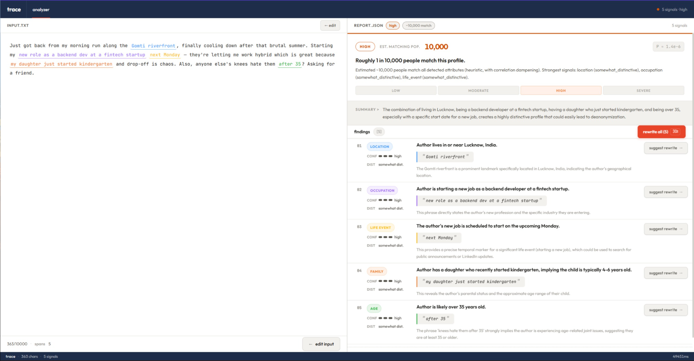

# trace

A privacy audit tool. Paste a draft post you're about to publish under a pseudonym — trace tells you what an LLM-powered attacker could infer about your real identity, highlights the exact phrases that leaked the information, and suggests minimum-edit rewrites to remove the signals.



---

## What it does

- **Extracts** identity signals from your text across 12 leak categories (location, occupation, age, family, health, and more)
- **Scores** joint identifiability — individual attributes may be common, but combinations create a fingerprint
- **Highlights** the exact substrings that revealed each signal, color-coded by category
- **Suggests** minimum-edit rewrites that preserve meaning but remove the identifying signal
- **Copies** the rewritten text to clipboard so you can re-analyze or post directly

Inspired by ["Large-scale online deanonymization with LLMs"](https://arxiv.org/abs/2602.16800v1) (Lermen et al., 2026).

---

## Stack

| Layer | Tech |
|---|---|
| LLM | Gemini 2.5 Flash via `google-genai` SDK |
| Backend | FastAPI + uvicorn |
| Schema | Pydantic v2 |
| Frontend | React + Vite + TypeScript |
| Styling | Tailwind v4 + shadcn/ui (Nova theme) |
| Fonts | Outfit + JetBrains Mono |

---

## Local setup

### Prerequisites
- Python 3.11+
- Node.js 18+
- A [Gemini API key](https://aistudio.google.com/app/apikey)

### Backend

```bash
cd backend
python -m venv venv
venv\Scripts\activate        # Windows
# source venv/bin/activate   # Mac/Linux
pip install -r requirements.txt
cp .env.example .env
# add your GEMINI_API_KEY to .env
uvicorn main:app --reload
```

Backend runs at `http://localhost:8000`. Swagger docs at `http://localhost:8000/docs`.

### Frontend

```bash
cd frontend
npm install
npm run dev
```

Frontend runs at `http://localhost:5173`.

---

## API

### `POST /analyze`

Analyzes text for identity leaks.

**Request**
```json
{ "text": "your draft post here" }
```

**Response** — `LeakReport`
```json
{
  "findings": [...],
  "overall_risk": "high",
  "summary": "...",
  "risk": {
    "joint_fraction": 1.25e-5,
    "matching_population": 100000,
    "headline": "Roughly 1 in 100,000 people match this profile.",
    "band": "moderate",
    "explanation": "..."
  }
}
```

### `POST /rewrite`

Suggests a minimum-edit rewrite for a single finding.

**Request**
```json
{
  "text": "original post text",
  "finding": { ...finding object... }
}
```

**Response**
```json
{
  "original": "backend dev at a fintech startup",
  "suggestion": "a developer role",
  "delta": "Removed specific industry and role type"
}
```

---

## Risk bands

| Band | Matching population | Meaning |
|---|---|---|
| Low | 5M+ | Essentially unidentifiable from this text alone |
| Moderate | 100K–5M | Some specificity, not immediately actionable |
| High | 5K–100K | Genuinely concerning combination of signals |
| Severe | <5K | Highly distinctive — strongly consider rewriting |

---

## Non-goals

- No scraping of third-party accounts
- No "paste a Reddit username" feature  
- No cross-platform matching
- Not a replication of the deanonymization attack pipeline

trace only ever analyzes text you provide. Nothing leaves your browser except the POST request to the backend.

---

## Deploy

See [deployment guide](#) for Railway (backend) + Vercel (frontend) setup.